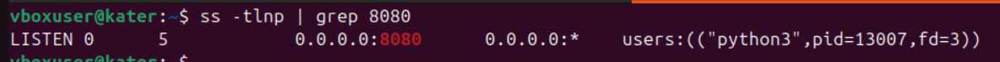
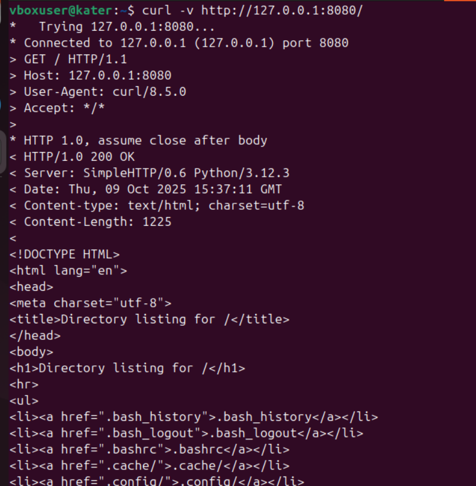
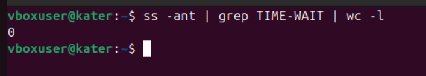
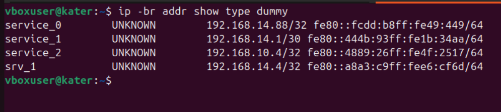
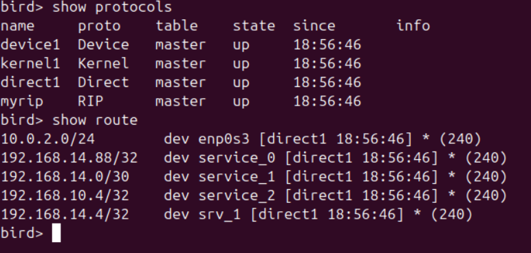
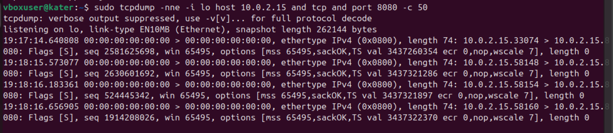
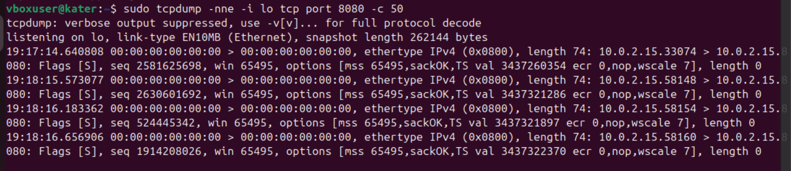
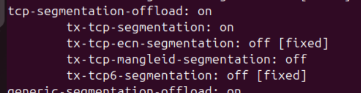

# highload_lab4_linux


---
# Домашняя работа: «Сетевой стек» — домашнее задание

---

## Требуемые пакеты

```bash
sudo apt update && sudo apt install -y bird2 nftables ethtool curl net-tools python3 tcpdump iproute2
```

---

# Задание 1. Анализ состояний TCP‑соединений (25 баллов)

**Цель:** запустить Python HTTP сервер, подключиться к нему, изучить состояния TCP-сокетов (ss), объяснить появление TIME-WAIT и его роль.

### Шаги и команды

1. Запустить сервер:

```bash
python3 -m http.server 8080
```

2. Найти слушающий сокет с помощью `ss`:

```bash
ss -tlnp | grep 8080
```



3. Подключиться к серверу через `curl` :

```bash
curl -v http://127.0.0.1:8080/
```



4. После закрытия соединения посмотрите все сокеты и найдите те, которые в состоянии `TIME-WAIT`:

```bash
ss -ant | grep TIME-WAIT | wc -l
ss -ant | grep TIME-WAIT | head -n 20
```



### Почему появляется сокет в состоянии TIME-WAIT и какова его роль?

TIME-WAIT возникает после закрытия TCP-соединения стороной, которая инициировала разрыв (обычно клиент).  
Это состояние необходимо для того, чтобы убедиться, что все пакеты старого соединения полностью покинули сеть  
и не будут приняты как часть нового соединения с тем же IP-адресом и портом.

Роль TIME-WAIT: гарантировать корректное завершение соединения и предотвратить смешивание данных старых и новых TCP-сессий.

---

### Почему TIME-WAIT нельзя просто удалить?

TIME-WAIT нельзя удалять вручную, так как оно служит для надёжности TCP.  
Если убрать его слишком рано, старые пакеты от предыдущего соединения могут попасть в новое и вызвать ошибки  
(например, повреждение данных или ложные ответы сервера).  
Операционная система автоматически очищает TIME-WAIT по истечении таймера (обычно 60 секунд).

---

### К каким проблемам может привести большое количество TIME-WAIT сокетов?

Большое количество TIME-WAIT-сокетов может привести к:
- исчерпанию доступных локальных портов при большом количестве коротких соединений;
- увеличению нагрузки на таблицы сокетов в ядре;
- временной невозможности установить новые соединения к тем же адресам и портам.

В моём эксперименте значение ss -ant | grep TIME-WAIT | wc -l показало 0,  
так как тест выполнялся локально (`localhost`), и соединение завершилось слишком быстро,  
поэтому состояние TIME-WAIT не успело появиться.

---

# Задание 2. Динамическая маршрутизация с BIRD (35 баллов)

**Цель:** создать dummy‑интерфейсы и настроить BIRD так, чтобы анонсировались только нужные адреса через RIP v2.

### Создание интерфейсов

```bash
# Создаём dummy интерфейс service_0 с адресом /32
sudo ip link add service_0 type dummy
sudo ip addr add 192.168.14.88/32 dev service_0
sudo ip link set service_0 up

# Дополнительные интерфейсы
sudo ip link add service_1 type dummy
sudo ip addr add 192.168.14.1/30 dev service_1
sudo ip link set service_1 up

sudo ip link add service_2 type dummy
sudo ip addr add 192.168.10.4/32 dev service_2
sudo ip link set service_2 up

sudo ip link add srv_1 type dummy
sudo ip addr add 192.168.14.4/32 dev srv_1
sudo ip link set srv_1 up

# Проверка
ip -brief addr show service_0 service_1 service_2 srv_1
```

вывод `ip addr`:



### Конфигурация BIRD (пример)

пример конфигурации BIRD, сохраняем как `~/bird.conf` для теста:

```text
router id 192.0.2.1;

protocol device {
}

protocol kernel {
    persist;          # сохранять маршруты при перезапуске
    scan time 20;      # период сканирования изменений
}

protocol direct {
    interface "*";
}

protocol rip myrip {
    import all;

    export filter {
        if net ~ 192.168.14.0/24 then accept;
        reject;
    };

    interface "enp0s3";
}
```

### Проверка анонсов с помощью tcpdump

Запустим tcpdump на интерфейсе, который BIRD использует для RIP (обычно broadcast/udp port 520):

```bash
sudo tcpdump -nne -i enp0s3 udp port 520 -c 200
```

- вывод команды `birdc show rip`:




---

# Задание 3. Настройка фаервола / Host Firewalling (25 баллов)

**Цель:** запретить подключения к порту 8080 с помощью nftables или iptables и продемонстрировать результат.

### iptables:

```bash
sudo iptables -I INPUT -p tcp --dport 8080 -j REJECT
sudo iptables -L -n --line-numbers
```

### Демонстрация

1. Запустим `python3 -m http.server 8080`.
2. С одного хоста выполним `curl -v http://10.0.2.15:8080/` — запрос должен быть заблокирован.

Вставим tcpdump со стороны сервера и со стороны клиента, чтобы показать, что пакеты приходят, но соединение не устанавливается / сбрасывается:

```bash
# на сервере
sudo tcpdump -nne -i enp0s3 tcp port 8080 -c 50

# на клиенте
sudo tcpdump -nne -i enp0s3 host 10.0.2.15 and tcp and port 8080 -c 50
```

скриншоты:






### Почему правило firewall работает и как это подтверждает tcpdump

**Почему правило работает:**
- Мы создали правило firewall, запрещающее подключения к порту 8080 (`DROP` или `REJECT`).
- Это означает, что любой входящий TCP-трафик на этот порт **не может достичь приложения**, даже если сервер слушает.
- В нашем случае Python HTTP сервер слушает порт 8080 (`lsof -i:8080`), но соединение не устанавливается, что подтверждает работу правила.

**Как это подтверждает tcpdump:**
- Tcpdump, запущенный на интерфейсе `lo` (localhost), показывает только **SYN-пакеты от клиента к серверу**.
- Ответного SYN+ACK нет — сервер не успевает ответить или пакет блокируется на уровне firewall.
- Это демонстрирует, что **соединение не устанавливается**, и правило firewall реально работает.

**Вывод:**
- Попытки соединения фиксируются клиентом (curl) и tcpdump, но сервер на порт 8080 не отвечает.
- Таким образом, правило firewall эффективно блокирует входящие подключения.
---

# Задание 4. Аппаратное ускорение сетевого трафика (offloading) (15 баллов)

**Цель:** исследовать возможности offload сетевого адаптера и показать статус TCP segmentation offload (TSO).

### Команда ethtool

```bash
ip -brief link

sudo ethtool -k enp0s3
```

вывод `ethtool -k`:



Включён ли TCP segmentation offload (TSO)?

 Ответ: да. Пояснение: В выводе ethtool видно, что tcp-segmentation-offload включён (on), а также tx-tcp-segmentation включён. Это означает, что сетевой адаптер способен самостоятельно разбивать большие TCP-сегменты на MTU, разгружая CPU.

Какую задачу решает TSO.

Ответ: TSO решает задачу уменьшения нагрузки на CPU при передаче больших объемов TCP-трафика. Аппаратное ускорение позволяет сетевой карте самостоятельно сегментировать большие TCP-пакеты на подходящие фреймы, что снижает количество прерываний и повышает производительность сети.


